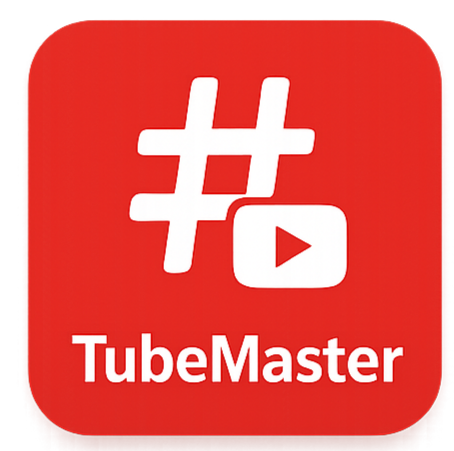

# 📊 YouTube SEO Analyzer Chrome Extension

**Version:** 1.0.0  
**Icon:**   

A powerful and advanced Chrome extension that extracts and analyzes SEO-related data from YouTube videos. Get instant insights into a video’s title, description, tags, and SEO score — right from your browser.

---

## 🚀 Features

* ✅ Extract video title, meta description, and keyword tags
* 📈 Calculate SEO Score using advanced metrics
* 📋 Copy title, description, or tags to clipboard with one click
* 🧠 SEO Score logic includes keyword overlap, tag count, emoji bonus, and more
* 🧪 Live analysis directly from any YouTube watch page
* 🔒 Lightweight, secure, and fast

---

## 🧠 SEO Scoring Logic

The SEO score (out of 100) is calculated based on:

| Criteria                        | Points |
| ------------------------------- | ------ |
| Title length (30–70 chars)      | +25    |
| Description length (≥100 chars) | +25    |
| At least 5 tags                 | +25    |
| Title contains relevant tags    | +25    |
| Emoji in title                  | +5     |
| Duplicate tags                  | −5     |
| Keyword matches in description  | +10    |

---

## 📦 Installation

1. Clone or download this repo:

   ```bash
   git clone https://github.com/shiboshreeroy/youtube-seo-analyzer-extension.git
    ```


2. Open **Chrome** and go to:

   ```
   chrome://extensions/
   ```

3. Enable **Developer Mode** (top right)

4. Click **"Load unpacked"** and select the project folder

---

## 🧪 How to Use

1. Visit any YouTube video
2. Click on the extension icon in the Chrome toolbar
3. The popup displays:

   * Video Title
   * Description Length
   * SEO Score
   * Extracted Tags
4. Use **Copy** buttons to grab content instantly

---

## 🛠️ Project Structure

```bash
youtube-seo-analyzer-extension/
├── manifest.json
├── popup.html
├── popup.js
├── content.js
├── style.css
└── icons/
```

---

## ✍️ Author

* **Name**: Shiboshree Roy
* **Email**: [shiboshreeroycse@gmail.com](mailto:shiboshreeroycse@gmail.com)

---

## 📜 License

MIT License — feel free to use and modify this extension for personal or commercial projects.

---